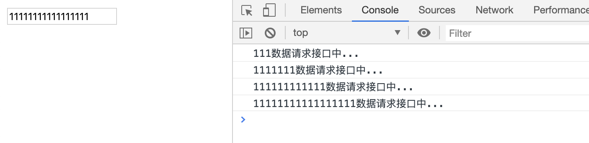
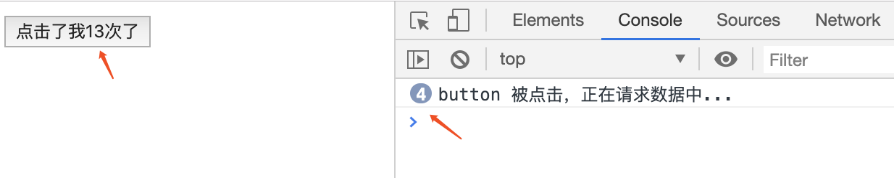

# 防抖和节流

## 防抖

`debounce(func, wait)`：抖完了以后（wait 秒内没有抖）再执行

### 思路

setTimeout 等待 wait 秒后，如果 wait 秒内再次执行则取消上一个执行函数，然后结合闭包来保证不会被内存释放

### 场景

减少没必要的刷新及数据请求（看着晃眼），如：input 搜索实时请求接口数据

### 代码实现

```javascript
const debounce = function (fn, wait = 1000) {
  let timer = null;

  return function () {
    //清除定时器
    clearTimeout(timer);

    //设置定时器
    timer = setTimeout(() => {
      fn.call(this, arguments)
    }, wait)
  }
}
```

验证：

```javascript
const search = document.querySelector('#search');

//模拟请求数据
const request = () => console.log(`${search.value}数据请求接口中...`);

//搜索处理
search.addEventListener('input', debounce(request, 500));
```

效果：




## 节流（节制）

`throttle(func, wait)`： 执行完了以后，等待 wait 秒

### 思路

事件第一次触发的时候，记录下函数执行的时间点，当函数想要再一次执行，需要间隔一定的时间才能执行

### 场景

无顺序请求（避免重复提交）、scroll、resize

### 代码实现

```javascript
const throttle = function (fn, intervalTime = 100) {
  var timestamp = 0;

  return function () {
    // 获取现在的时间
    var nowTime = new Date().getTime();

    // 节制期间内，不允许执行
    if (nowTime - timestamp < intervalTime) return;

    // 正常执行
    fn.call(this, arguments);
    timestamp = nowTime;
  }
}
```

验证：

```javascript

const button = document.querySelector('#button');

//模拟请求数据
const request = () => console.log(`button 被点击，正在请求数据中...`)

// button 处理
button.addEventListener('click', throttle(request, 500))
```

效果：



