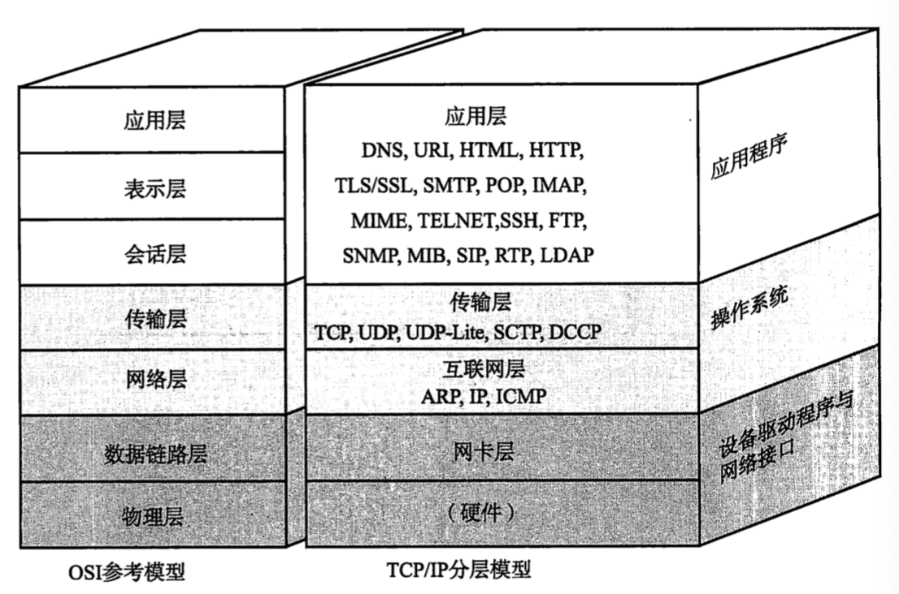
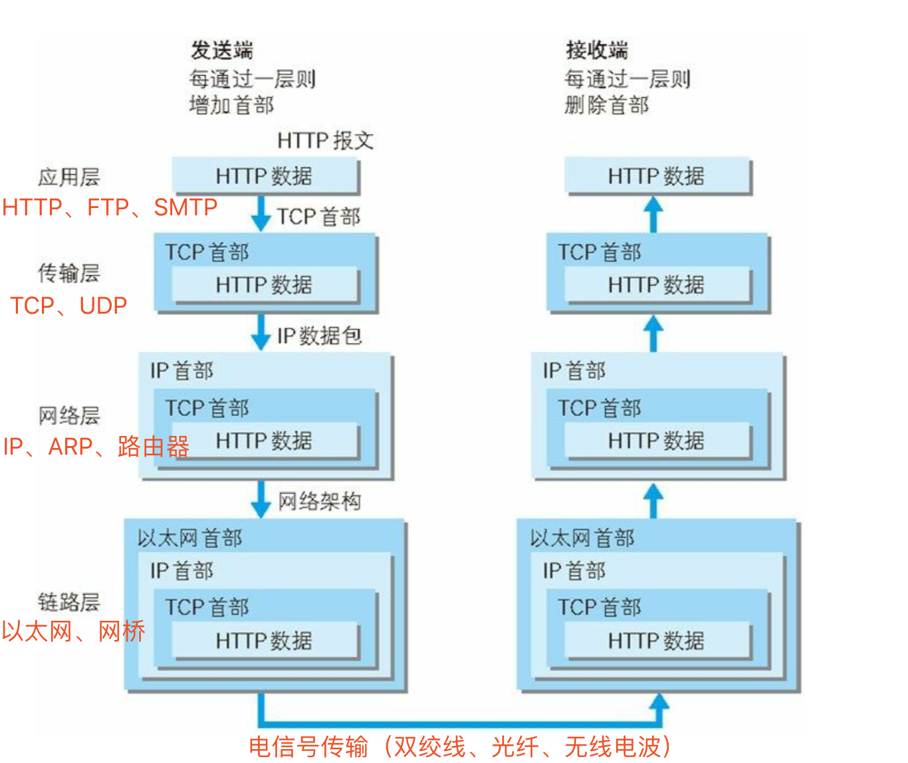
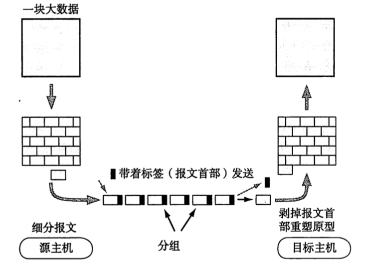

# TCP/IP协议族

TCP/IP 是通信协议的统称，模型中用协议定义了每一层的作用，协议是一种约定（规范），我们日常使用的就是遵循各个协议具体规范的产品和通信手段。

## TCP/IP 协议分层模型

分层从上到下依次为：应用层、传输层、网络层、数据链路层、（物理层）。

每个分层都接收由它下一层所提供的特定服务，并且负责为自己的上一层提供特定的服务。上下层之间交互遵循的约定叫做`接口`，同一层之间的交互遵循的约定叫做`协议`。

发送方由上到下按顺序依次传输数据，每到一层在处理传递过来的数据时附上当前层的协议所必需的首部信息，然后接收方对收到的数据进行首部与内容剥离后转发给上一层由下到上，最终将发送端数据恢复原状。

由下到上每一层的作用：

### 第一层：物理层

TCP/IP 最底层是负责数据传输的硬件，如光缆、电缆、双绞线、无线电波等方式，作用是负责传送 0和1 的电信号

### 第二层：数据链路层

**数据链路层可以将电信号（物理介质处理的电压高低、光的闪灭等）组合成`以帧为单位的数据包`用`广播`的方式通过`物理介质`传递给接收方。【建立计算机与计算机之间的通信】**

#### 怎么将电信号转成数据包？

以太网规定了一组电信号构成一个数据包（`帧 Frame`），每一帧由标头（Head）
和数据（Data）构成，整个帧的长度最短64个字节，最长1518个字节，如果数据过长就必须分割成多个帧进行发送。

- 标头：数据包的说明项，如发送者、接受者、数据类型等，长度固定为18个字节
- 数据：数据包的具体内容，长度最短46个字节，最长1500个字节

#### 怎么找到数据包的接收地址？

以太网规定所有连入网络的设备都必须有`网卡`接口，数据包必须从一个网卡传递到另一个网卡，而每块网卡出厂都必须有一个独一无二的 `MAC 地址`，这个`MAC 地址`是用来`标识同一个链路中不同计算机的一种识别码`。可以用来定位网卡和数据包的发送地址、接收地址。

#### 怎么把数据包发送出去？

以太网协议采用了一种很原始的方法，直接向子网络内所有计算机发送数据包，让这些计算机自己通过读取数据包的标头找到接收方的`MAC 地址`，然后再与自己的 MAC 地址作比较，如果两者相同则确定是发送给自己的并做进一步处理，否则丢弃这个数据包。这种发送方式叫做`广播`。

🍑🍃

有了数据包的定义、网卡的 MAC 地址、广播的发送方式，“数据链路层” 就可以在多台计算机之间传送数据了。

### 第三层：网络层

网络层使用 IP 协议，IP 协议可以将`分组的数据包`发送到目标主机【建立主机到主机的通信】

在计算机通信中，为了识别通信对端，必须要有一个类似于地址的识别码进行标识。

#### IP 地址

IP 地址是 Internet Protocol Address 的缩写，译为“网际协议地址”。

目前大部分软件使用 IPv4 地址，但 IPv6 也正在被人们接受，尤其是在教育网中，已经大量使用。

一台计算机可以拥有一个独立的 IP 地址，一个局域网也可以拥有一个独立的 IP 地址（对外就好像只有一台计算机）。对于目前广泛使用 IPv4 地址，它的资源是非常有限的，一台计算机一个 IP 地址是不现实的，往往是一个局域网才拥有一个 IP 地址。

在因特网上进行通信时，必须要知道对方的 IP 地址。实际上数据包中已经附带了 IP 地址，把数据包发送给路由器以后，路由器会根据 IP 地址找到对方的地里位置，完成一次数据的传递。路由器有非常高效和智能的算法，很快就会找到目标计算机。

#### ICMP

IP 数据包在发送途中发生异常导致无法到达对端目标地址时，ICMP可以给发送端发送一个异常通知，有时也被用来诊断网络健康状况

#### ARP

从分组数据包的 IP 地址中解析出物理地址（MAC 地址）

#### 何为分组的数据包？

网络的通信方式`分组交换`是指将大数据分割成为一个个叫做`包（Packet）`的较小单位进行传输的方法。

就像邮寄包裹时，我们会将寄件人、收件人、地址等信息写在寄件单上交给邮局一样，在计算机通信协议中，把要发送的数据分成多个包，按照一定的顺序排列后分别发送，数据被细分后，所有计算机可以一齐收发数据，为了表明是原始数据中的哪一部分，会将分组的序号写入包中（报文首部），接收端会根据这个序号将每个分组再重新装配为原始数据。

报文首部包含发送端和接收端地址，即使使用同一条线路同时为多个用户提供服务，也可以明确区分每个分组的数据发往的目的地及与是哪台计算机进行的通信。

🍃 处理过程

发送端计算机将数据分组发送给路由器，路由器收到分组数据后按顺序缓存到自己的缓冲区，然后再转发（先进先出）给目标计算机。

### 第四层：传输层

有了 MAC 地址和 IP地址，我们就已经可以在互联网上任意两台计算机之间建立通信了，但是计算机内部通常同一时间运行多个程序，所以我们需要把传输的数据和应用程序对应起来。传输层就提供了`端口号（也被称为程序地址）`来`识别同一台计算机中进行通信的不同应用程序`。【建立端口到端口之间通信】

该层由两个具有代表性的协议，分别是 TCP、UDP

#### TCP

一种面向有连接的传输层协议。他可以保证两端通信主机间的通信可达，能正确处理在传输过程中丢包、传输顺序乱掉等异常情况，它还能有效的利用宽带，缓解网络拥堵。

缺点：过程复杂、实现困难、消耗较多的资源。

#### UDP
一种面向无连接的传输层协议。不关心对端是否收到了传送过去的数据。

缺点：可靠性较差，一旦数据包发出，无法知道对方是否收到

### 第五层：应用层

应用层主要负责数据格式的转换，将应用处理的信息转换为适合网络传输的格式。

## 完整流程

首先我们梳理一下每层模型的职责：

- 链路层：对0和1进行分组，定义数据帧，确认主机的物理地址，传输数据；
- 网络层：定义IP地址，确认主机所在的网络位置，并通过IP进行MAC寻址，对外网数据包进行路由转发；
- 传输层：定义端口，确认主机上应用程序的身份，并将数据包交给对应的应用程序；
- 应用层：定义数据格式，并按照对应的格式解读数据。

然后再把每层模型的职责串联起来，用一句通俗易懂的话讲就是，当你输入一个网址并按下回车键的时候：

::: tip

应用层协议对该请求包做了格式定义；

传输层协议加上了双方的端口号，确认了双方通信的应用程序；

网络层加上了双方的IP地址，确认了双方的网络位置；

最后链路层协议加上了双方的MAC地址，确认了双方的物理位置，同时将数据进行分组，形成数据帧，采用广播方式，通过传输介质发送给对方主机。

而对于不同网段，该数据包首先会转发给网关路由器，经过多次转发后，最终被发送到目标主机。

目标机接收到数据包后，采用对应的协议，对帧数据进行组装，然后再通过一层一层的协议进行解析，最终被应用层的协议解析并交给服务器处理。
:::

## 资料

🍃 [深入浅出 TCP/IP 协议栈](https://www.cnblogs.com/onepixel/p/7092302.html)

🍃 [互联网协议入门（一）](http://www.ruanyifeng.com/blog/2012/05/internet_protocol_suite_part_i.html)

🍃 [IP、MAC和端口号——网络通信中确认身份信息的三要素](http://c.biancheng.net/view/2132.html)

🍃 《图解TCP+IP(第5版)》  