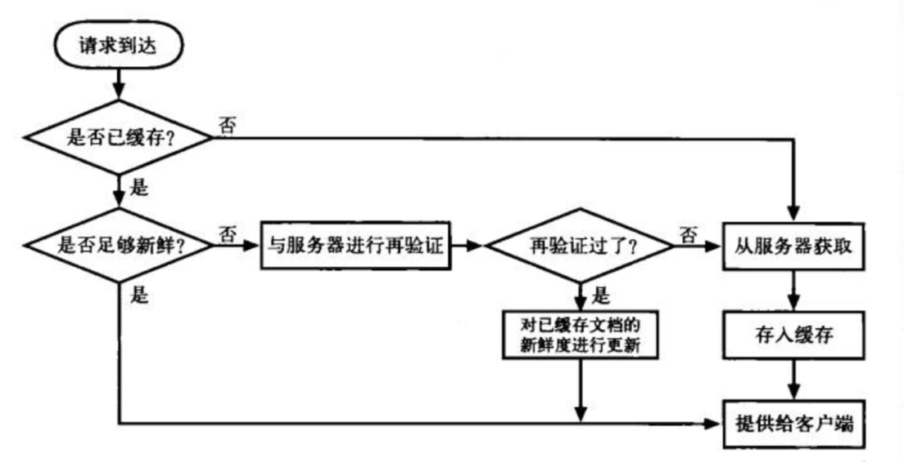
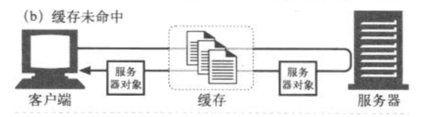
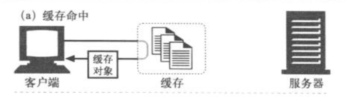
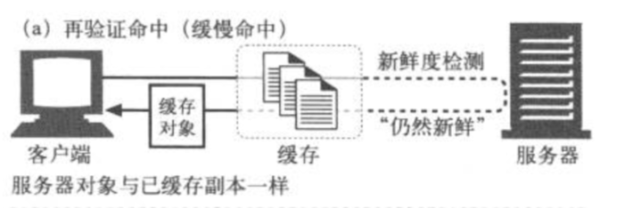
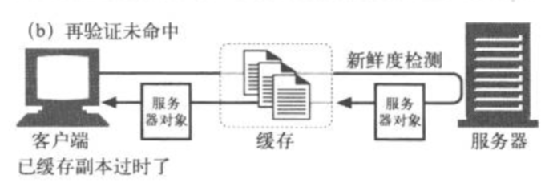

# HTTP 缓存

## 为什么要使用缓存 ？

缓存是可以自动保存为常见文档副本的 HTTP 设备，当 web 请求抵达缓存时。如果本地有`已缓存了的副本`，就可以从本地存储设备上直接提取这个文档，而不用去服务器中提取。

缓存可以帮助我们：

- 缓解服务器压力，提高了网站性能
- 加快了网页加载速度，提升了用户的使用体验
- 减少了冗余的数据传输，帮助网络运营减少了流量

## HTTP 缓存处理流程 



### 第一步：接收请求并解析

缓存从网络中读取抵达的请求报文，然后将请求报文解析成片段，将首部的各个部分放入易于操作的数据结构中，这样缓存就更容易处理首部字段并修改它们了

### 第二步：查找缓存副本

缓存获取 URL，查找`本地副本`。本地副本存储在内存、本地磁盘等地方，缓存会确认本地缓存中是否有这个`对象`，查找会有以下两种结果：

####  第一种结果：未找到可用副本

到达缓存的请求因为没有查找到可用的副本，会将请求转发给原始服务器去获取资源（缓存未命中），并将该资源缓存在本地



#### 第二种结果：已找到可用副本

到达缓存的请求查找到了`可用副本`，在向客户端提供该文档之前，HTTP 会对此文档进行`新鲜度检测`。

HTTP 通过缓存将服务器文档的副本保留一段时间，这段时间内（默认一小时或一天）都认为文档是新鲜的，缓存可以在不联系服务器的情况下直接提供向客户提供该文档（缓存命中，200 OK）。



一旦已缓存副本停留的时间过长，超过了文档的`新鲜度限值`，就会认为该对象不新鲜，这种情况下缓存会向服务器发送一个`再验证请求`来进行确认，以便查看文档是否发生了变化，再验证可能的结果如下：

- 再验证命中

如果内容没有变化，服务器会向客户端发送一个`HTTP 304 Not Modified` 的响应，缓存知道副本仍然有效了，就会对该缓存文档新鲜度进行更新，然后将缓存文档返回给客户端。



- 再验证未命中

如果服务器的内容有变化，就从服务器上重新获取该资源，并更新本地的缓存数据（200 OK）



- 对象被删除

如果内容被删除，服务器返回一个`404 Not Found`，缓存也会将其副本删除掉。

::: tip
新鲜度检测流程：

- 浏览器第一次向服务器发起请求：

  服务端在响应头返回协商缓存的头属性：ETag、Last-Modified；

- 浏览器第二次向服务器发发起请求：

  在请求头中带上与 ETag 对应的 If-Not-Match（值为上次请求时返回响应头的 ETag 值）和与 Last-Modified 对应的 If-Modified-Since。
  
  服务器接收到这两个参数后会作比较，看看资源有没有失效或者有更改。如果返回的是 304 状态码，则表示资源没有任何修改，缓存会标记副本为新鲜并把资源返回给客户端，否则服务器会返回200 状态码，直接返回一份新的资源。
:::

### 第三步：创建响应

缓存将副本返回给客户端的时候，会将已缓存的服务器响应首部作为响应首部的起点，然后在这基础上对首部进行了修改和扩充，以便于客户端的要求相匹配，而且还会插入新鲜度的值信息（Cache-control、Age、Expires首部）及一个Via首部来说明该请求来自代理缓存。

### 第四步：发送相应给客户端

响应首部准备完毕后，缓存会将该响应返回给客户端。

## HTTP 缓存的分类

HTTP 可分为`强缓存`和`协商缓存`，两者的本质区别就在于是否要和服务器进行交互，详细如下：

### 第一类：强缓存

在缓存未失效的情况下，可直接由缓存提供资源给客户端使用（状态码 200），而不用去请求服务端。`缓存命中`就属于强缓存。

和强缓存有关属性有（优先级由高到低）：Pragma、Cache-Control、Expires

- Pragma

```html<meta http-equiv='Pragma' content='no-cache'/>```

如果 html 的 meta 标签如果这样的话，它的意思是可以告诉浏览器当前页面不被缓存，每次访问都需要去服务器拉取。这种方法使用上很简单，但只有部分浏览器可以支持，而且所有缓存代理服务器都不支持，因为代理不解析HTML内容本身。

上述代码的作用是告诉浏览器当前页面不被缓存，每次访问都需要去服务器拉取。这种方法使用上很简单，但只有部分浏览器可以支持，而且所有缓存代理服务器都不支持，因为代理不解析HTML内容本身。

- Expire

http/1.0 提出，一个表示资源过期时间的 header，描述的是一个绝对时间，由服务器返回，值是用 GMT 格式的字符串表示，如：Expires:Thu, 31 Dec 2016 23:55:55 GMT

读取缓存数据条件：缓存过期时间（服务器的）< 当前时间（客户端的）

缺点：它是服务器返回的一个绝对时间，因此如果客户端和服务端时间不匹配的话，就容易出现误差，因此 http/1.1版本开始使用 Cache-Control 来代替它

- Cache-Control

它描述的是一个相对时间，在进行缓存命中的时候，都是利用客户端时间来判断的，所以想比较 Expire 来说，`Cache-Control` 更有效更安全一些，它的可选属性如下：
  1. no-cache：不使用强缓存，使用协商缓存
  2. no-store：不适用缓存，每次都是请求新的下载资源
  3. max-age：缓存时长（秒）
  4. public/private：缓存共有或私有
  5. must-revalidate：每次访问需要缓存校验
 
### 第二类：协商缓存

已缓存副本停留时间过长，被认为不新鲜的时候，缓存要和服务器进行交互，向服务器发送`再验证请求`。`缓存再验证命中（状态码 304）`和`缓存再验证未命中（状态码 200）`就属于协商缓存。

和协商缓存有关的属性有（优先级由高到低）：ETag/If-Not-Match、Last-Modified/If-Modified-Since：

- ETag：hash值，能精确的判断资源有没有被修改，可识别一秒内的修改次数
- Last-Modified：GMT格式的最后修改时间，只要资源有修改，无论内容是否变化都会将资源返回客户端，以时刻作为表示，无法获取一秒内的修改变化

## 如何设置 HTTP 缓存？

缓存一般情况下都是在服务器上配置的，但是如果我们想在无需 web 服务器的配置文件进行交互的情况下控制缓存，可以通过`HTML 的 meta 标签来配置`，如下：

### html 页面配置缓存

```html
<meta http-equiv='Cache-Control' content='max-age=7200'/>
<meta http-qeuiv='Expires' content='Mon, 20 Aug 2018 23:00:00 GMT'/>
```
### html 页面禁用缓存配置

```html
<meta http-equiv='Pragma' content='no-cache'/>
<meta http-equiv='Cache-Control' content='no-cache'/>
<meta http-equiv='Expires' content='0'/>
```

以上这些配置方法，web 服务器会为 html 解析 ```html <meta http-equiv>```标签，并将规定首部插入 HTTP 响应中，部首名称从 HTTP-EQUIV 属性中获取，部首值从 CONTENT 属性中获取。

但是支持这个可选特性会增加服务器额外负载，这些值也只是静态的，并且只支持 html，不支持其他文件类型，所以很少有 web 服务器和代理支持此特性。

而且，这种方式的效果也不是很好，大多数软件都会忽略 HTTP-EQUIV 标签，即使支持 HTTP-EQUIV 标签的 html 浏览器使用的 Cache-Control 规则可能也会与拦截代理缓存所用的规则不同，这样会使缓存的过期处理行为发生混乱。

::: danger
因此，由经过正确配置的服务器发送的 HTTP 首部来交流对文档的缓存控制请求是唯一可靠的办法。
:::

## 实际应用

我们在项目中，如果很好的应用缓存呢？

一般情况下，我们会对`css、js、logo、图片等这些不太经常变动的资源`应用缓存，一些设计到业务的比较敏感的文件不适合应用缓存。

## 资料

🍃 [说说web缓存-强缓存、协商缓存](https://www.cnblogs.com/feng9exe/p/8083246.html)

🍃 [一文读懂http缓存（超详细）](https://www.jianshu.com/p/227cee9c8d15)

🍃 《HTTP 权威指南》


<style>
.theme-default-content:not(.custom) img {
    max-width: 500px;
}
</style>
