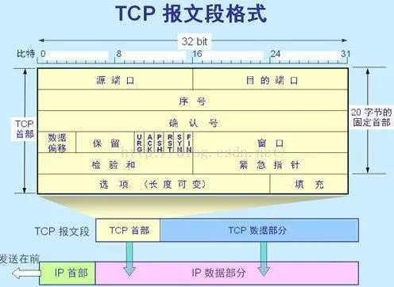
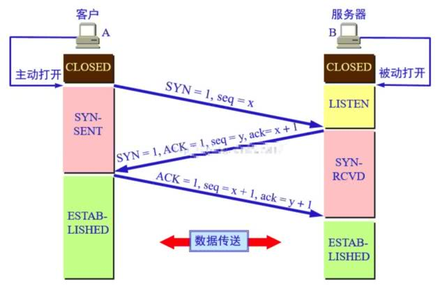
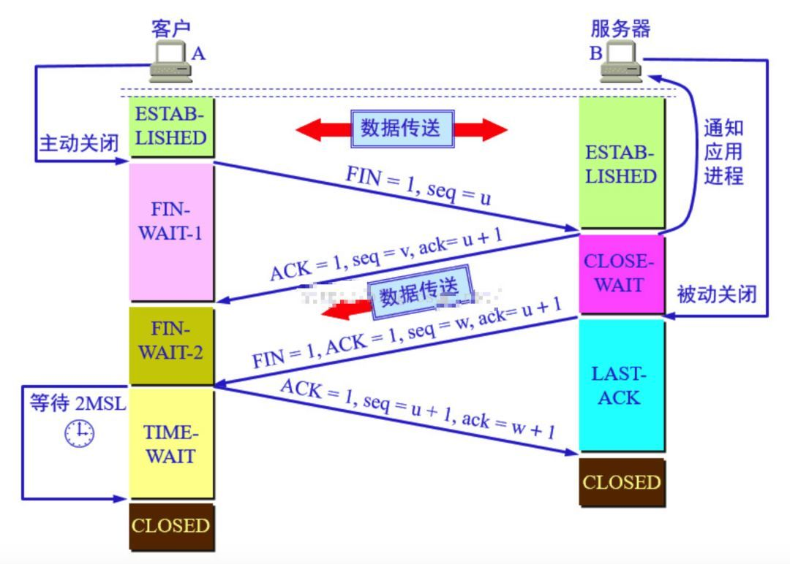

# TCP 三次握手 & 四次挥手

TCP 位于传输层，提供可靠的字节流服务。

> 可靠的字节流服务：TCP 协议为了传输方便，将大块数据分割成以`报文段（segment）`为单位的数据包进行管理，并能够把这些数据准确可靠的传递给对方。

## TCP报文段格式

下面是一张 TCP 报文格式的图片：

其中，几个比较重要的字段如下：

### 序号和确认号

每个 TCP 报文内都有序号和确认号，结合重传机制保障数据传输的可靠性

- seq 序号：TCP 连接字节流中每一个字节都会有一个编号，当建立连接的时候，TCP 选定一个初始序号（随机数），之后每发送一个数据包（消息），就将
`序号+1`，保证每发送不同的数据包，数据包的序号都是不同的

- ack 确认号：表示希望收到的下一个报文段部分的第一个字节的序号是 `seq+1`，以前的字节已经收到过了，ACK标志位被设置为1的时候，才会发送ack确认号。

### 6个标志位

TCP 报文共有6个标志位，每个占1位，共6位，每一位的值只有0和1

- SYN：同步标志位，SYN=1 时，表示这是一个连接请求报文

- ACK：确认标志位，ACK=1 时，表示确认号有效，当 TCP 发送 ACK 时，相当于返回结果，需要带有确认序号，以便跟发送的消息对应起来。

- FIN：终止标志位，FIN=1 时，表示此报文段的发送方数据已发送完毕，要求释放 TCP 连接

- PSH：推送标志位，PSH=1 时表示该段报文高优先级，接收方应尽快推送给应用程序，而不用等整个 TCP 缓存都填满了在交付

- URG：紧急标志位，URG=1 时表示紧急指针有效，此报文中有紧急数据要尽快传送，不需要按照原来的排列顺序来传送

- RST：复位标志位，RST=1 时表示 TCP 连接中出现错误，需要释放并重新建立连接

## 建立 TCP 连接：三次握手

TCP 连接的建立采用客户-服务器模式，主动发起连接建立的应用进程叫做客户，被动等待连接建立的应用进程叫做服务器，以下是建立 TCP 连接的过程：

### 第一次握手

客户端向服务端发送`请求连接`报文，将报文`同步标志位 SYN 的值设置为1`，表示要创建连接，等待服务器确认，并进入`SYN_SENT`状态。`（报文首部：SYN=1， 初始序号 seq=x（x为随机生成数值））`

### 第二次握手

服务端接收到客户端的请求，回复给客户端确认报文，将报文`确认标志位 ACK 的值设置为1`，告诉客户端已收到它的请求，同意创建连接，并进入`SYN_RECV`状态。`（ACK=1，确认号 ack=x+1，SYN=1，初始序号 seq=y）`

### 第三次握手

客户端接收到服务端的确认报文之后，为了防止意外，再次向服务端发出确认报文，将报文`ACK 的值设置为1`，当服务端收到客户端发来的确认报文之后，TCP 连接建立，客户端和服务端都进入`ESTABLISHED`状态，完成三次握手，以后就可以开森的传递数据了。`（报文首部：ACK=1, 确认号 ack=y+1, 序号 seq=x+1（服务端传过来的ack的值）`

## 断开 TCP 连接：四次挥手

由于 TCP 连接是`双工`的，因此每个方向都必须单独进行关闭。当一方完成它的数据发送任务后就可以发送一个`FIN`终止标志位来终止这个方向上的连接，`收到一个FIN`就意味着`这一方向上没有数据流动`。一个 TCP 连接在收到一个 FIN 后仍能发送数据，首先进行关闭的一方将执行`主动关闭`，而另一方执行`被动关闭`。

### 第一次挥手

客户端主动向服务端发出`断开 TCP 连接`的请求报文，将报文`终止标志位 FIN 设置为1`，表示要释放 TCP 连接，并进入`等待结束连接状态FIN_WAIT-1` 。`（报文首部：FIN=1，序号 seq=u（u为随机数））`

### 第二次挥手

服务端收到客户端的释放连接请求后，回复确认报文给客户端，将报文`确认标志位 ACK 设置为1`，表示已收到客户端请求，`关闭服务端读通道`并进入`关闭等待状态 CLOSE-WAIT`。`（报文首部：ACK=1，确认号 ack=u+1（收到的序号+1），序号 seq=v（v为随机数））`

客户端收到确认报文后，会`关闭客户端写通道`，此时客户端仍能通过读通道读取服务端的数据，服务器仍能通过写通道写数据。

### 第三次挥手

服务端发送`断开 TCP 连接`的请求报文，将报文`终止标志位 FIN 设置为1`。表示服务端数据已发送完毕，要释放连接，不会再发送任何数据了。`（报文首部：FIN=1，ACK=1，确认号 ack=u+1（收到的序号+1），序号 seq=w（w为随机数））`

### 第四次挥手

客户端收到服务端的断开连接请求后，回复确认报文，将报文`确认标志位 ACK 设置为1`，`关闭客户端读通道`，服务端收到客户端的`确认报文`后，`关闭服务端读通道`。双方读写通道全部关闭，完成四次挥手。`（报文首部：ACK=1，确认号 ack=w+1（收到的序号+1），序号 seq=u+1（服务端传过来的ack的值））`

## 状态概述

- LISTEN：侦听来自远方TCP端口的连接请求 

- SYN-SENT：在发送连接请求后等待匹配的连接请求

- SYN-RECEIVED：在收到和发送一个连接请求后等待对连接请求的确认 

- ESTABLISHED：代表一个打开的连接，数据可以传送给用户

- FIN-WAIT-1：等待远程TCP的连接中断请求，或先前的连接中断请求的确认

- FIN-WAIT-2：从远程TCP等待连接中断请求

- CLOSE-WAIT：等待从本地用户发来的连接中断请求

- CLOSING：等待远程TCP对连接中断的确认 

- LAST-ACK：等待原来发向远程TCP的连接中断请求的确认 

- TIME-WAIT：等待足够的时间以确保远程TCP接收到连接中断请求的确认

- CLOSED：没有任何连接状态

## 几个疑问

### 为什么要三次握手而不是两次握手？

为了防止已失效的连接请求报文段突然又传送到了服务端，因而产生错误。

### 2MSL

在结束连接的过程中，为什么在收到服务器端的连接释放报文段之后，客户端还要继续等待2MSL之后才真正关闭TCP连接呢？

这里有两个原因：

第一个是：需要保证服务器端收到了客户端的最后一条确认报文。假如这条报文丢失，服务器没有接收到确认报文，就会对连接释放报文进行超时重传，而此时客户端连接已关闭，无法做出响应，就造成了服务器端不停重传连接释放报文，而无法正常进入关闭状态的状况。而等待2MSL，就可以保证服务器端收到了最终确认；若服务器端没有收到，那么在2MSL之内客户端一定会收到服务器端的重传报文，此时客户端就会重传确认报文，并重置计时器。

第二个是：存在一种“已失效的连接请求报文段”，需要避免这种报文端出现在本连接中，造成异常。这种“已失效的连接请求报文段”是这么形成的：假如客户端发出了连接请求报文，然而服务器端没有收到，于是客户端进行超时重传，再一次发送了连接请求报文，并成功建立连接。然而，第一次发送的连接请求报文并没有丢失，只是在某个网络结点中发生了长时间滞留，随后，这个最初发送的报文段到达服务器端，会使得服务器端误以为客户端发出了新的请求，造成异常。

## 资料

🍃 资料1：[史上最容易理解的：TCP三次握手，四次挥手](https://kuaibao.qq.com/s/20180627G0I4VO00?refer=cp_1026)

🍃 资料2：[TCP三次握手原理](https://www.jianshu.com/p/c9d245aa722a)

🍃 资料3：[TCP的三次握手(建立连接）和四次挥手(关闭连接）](https://zixuephp.net/article-428.html)