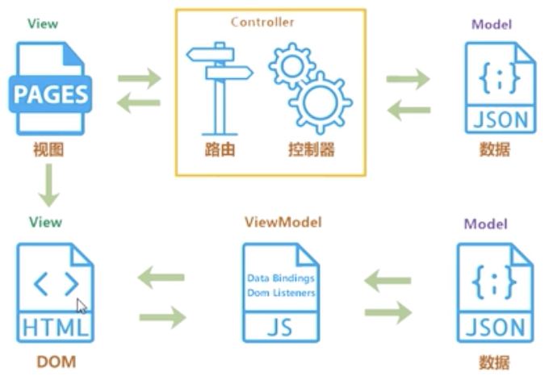

# Vue 进阶知识梳理

资料：珠峰架构公开课

## 谈一谈对 MVVM 的理解

#### MVC

当用户操作界面想获取数据时，向后端发送请求会首先到达`Controller`层，`controller`层的路由拦截到请求后会发给对应的控制器来进行处理，最终获取从`model`层拿到数据后再回显到视图上，这种方式是单向的

#### MVVM

以前，我们通过接口拿到数据后，都是手动将数据渲染到页面上，这样很麻烦，而`MVVM`不需要用户手动操作`DOM`元素，它将数据绑定在`VM`层，当数据有变化时，自动将数据渲染到页面中，同时，视图有变化是也会通知`VM`层来更新数据，`VM`层就是`MVVM`的桥梁，这种模式是双向的