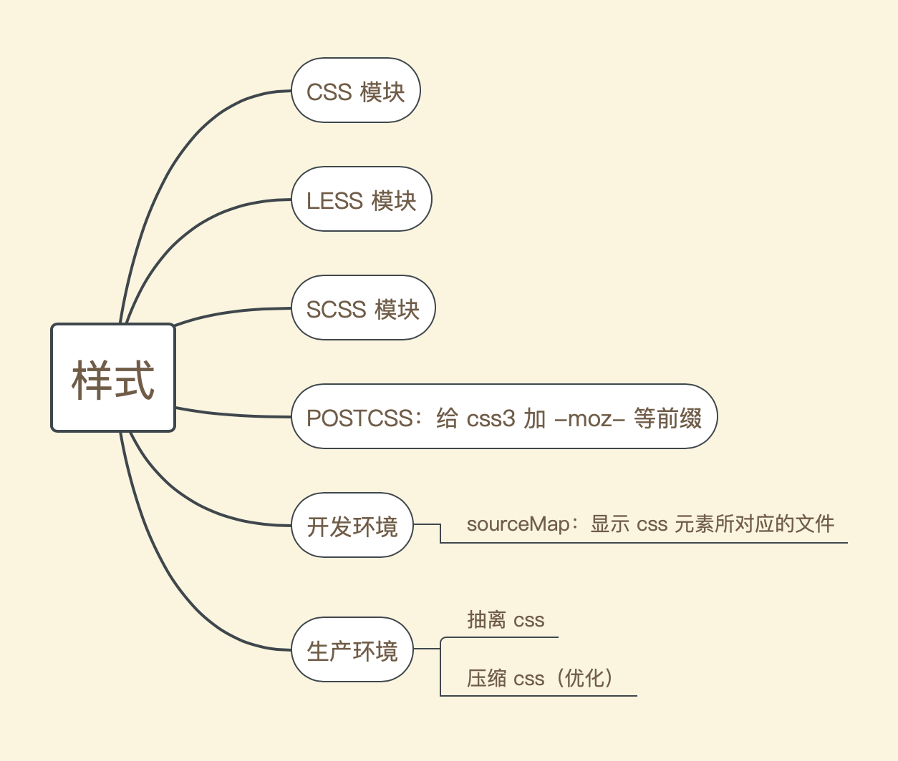
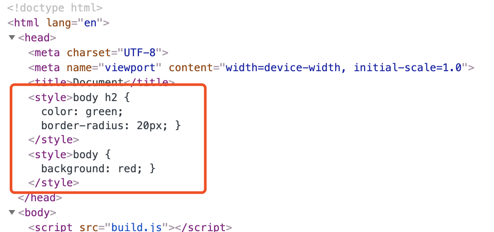
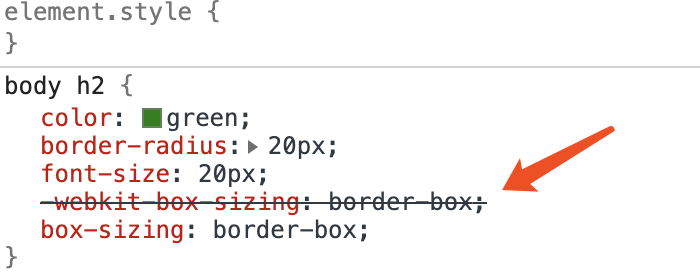
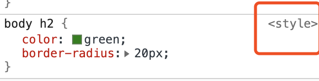
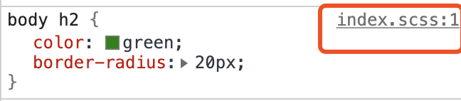
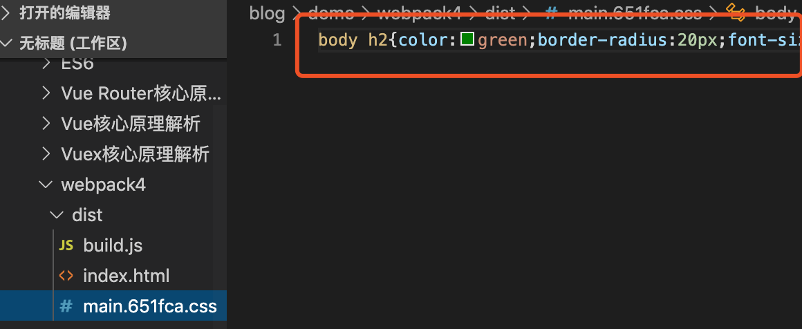

# 打包样式

## 概述

`webpack`中关于`css`的处理，大致包含以下这些：



## 准备工作

在`src`目录下创建`style`目录，用来保存样式文件。

`style`目录下分为新增：`index.css`、`index.less`、`index.scss`三个样式文件并写点什么，目录如下：

```
├─package.json
├─dist                // 存放最终打包的文件
│  └─index.html
├─src                 // 存放入口文件和开发文件
│  └─index.js  
│  └─style            // 样式管理
│    └─index.css  
│    └─index.less  
│    └─index.scss  
├─webpack.config.js   // webpack 配置文件
```

## CSS 模块处理

使用`webpack`处理`css`模块会用到以下两个 loader:

- style-loader：将`css`内容作为内联样式注入到`html`的`head`标签中

- css-loader：`css-loader`可以解释`@import`和`url()`

#### 使用

1. 安装：`cnpm install style-loader css-loader -D`

2. 编辑`webpack.config.js`文件，如下：

```javascript
// ...
module.exports = {
  // 略略略...
  module: {
    rules: [
      {
        test: /\.css$/,
        use: ['style-loader', 'css-loader']
      }
    ]
  }
}
```
3. 将`style/index.css`文件引入`index.js`中，并在终端中执行`npx webpack`开始打包。成功后，在浏览器中查看该页面，会发现打包后的`css`文件作为内联样式被嵌入到了`index.html`中的`style`标签中，如下:



## LESS 样式处理

使用`webpack`处理`less`模块时会用到以下 loader：

- less-loader：可以将`less`文件编译成`css`文件

#### 使用

1. 安装：`cnpm install less-loader less -D`

2. 编辑`webpack.config.js`文件，如下：

```javascript
// 略略略...
module.exports = {
  // ...
  module: {
    rules: [
      {
        test: /\.less$/,
        use: ['style-loader', 'css-loader', 'less-loader']
      }
    ]
  }
}
```

## SCSS 处理

使用`webpack`来处理`scss`文件时会用到以下 loader：

- sass-loader：将`scss`文件编译为`CSS`文件

#### 使用

1. 安装：`cnpm install node-sass sass-loader -D`

2. 编辑`webpack.config.js`文件，如下：

```javascript
//...
module.exports = {
  //...
  module: {
    rules: [
      {
        test: /\.scss$/,
        use: ['style-loader', 'css-loader', 'sass-loader']
      }
    ]
  }
}
```

## POSTCSS 处理

`postcss`可以自动给`css3`样式加`-webkit-，-moz-`等浏览器前缀，`webpack`在处理`postcss`的时候需要使用`postcss-loader`

#### 使用

1. 安装：`cnpm install postcss-loader -D`

2. 编辑`webpack.config.js`文件，如下：

```javascript
//...
module.exports = {
  //...
  module: {
    rules: [
      {
        test: /\.(c|sc)ss$/,
        use: [
          'style-loader', 
          'css-loader', 
          'sass-loader', 
          + {
          +   loader: 'postcss-loader',
          +    options: {
          +       plugins: [
          +         require('autoprefixer')
          +        ]
          +     }
          +  }
        ]
      }
    ]
  }
}
```

3. 想要`postcss`生效，我们需要配置下浏览器版本，符合该条件的会自动给`css`加浏览器前缀，打开`package.json`文件，
做如下配置：

```javascript
  // ...
  "browserslist": [
    // 全球浏览器使用率大于1%，最新两个版本并且是IE8以上的浏览器，加前缀 
    "> 1%",
    "last 2 versions",
    "not ie <= 8"
  ]
```

4. 将`style/index.scss`文件引入`index.js`中，终端中执行`npx webpack`命令进行打包编译，成功后会自动嵌入到`html`的`style`标签中，浏览器查看该页面会发现一些新特性的`css`已经被加了浏览器前缀，如下：



## development：sourceMap

开发环境中我们可以通过`sourceMap`追踪到样式所在的具体文件及位置等信息来方便我们的调试

#### 使用

```javascript
// ...
module.exports = {
  // ...
  module: {
    rules: [
      {
        test: /\.(c|sc)ss$/,
        use: [
          'style-loader', 
          // 'css-loader', 
          {
            loader: 'css-loader',
            + options: {
            +   sourceMap: true
            + }
          },
          'sass-loader', {
            loader: 'postcss-loader',
            options: {
              + sourceMap: true,
              plugins: [
                require('autoprefixer')
              ]
            }
          }
        ]
      }
    ]
  }
}
```

效果如下：

- `sourceMap` 使用前：无法定位到某个样式属于哪个文件



- `sourceMap` 使用后：可以清晰的显示样式所在的文件名称




## production：抽离 css

不同阶段我们需要对`css`做不同的配置处理：

- 开发阶段：通过`style-loader`可以把`css`注入到`html`的`style`作为内联样式存在

- 生产阶段：抽离`css`，通过外链的形式把`css`链接到`html`中

:::tip
抽离`css`只在生产环境中有效，即`mode: production`，并且把`css`从`style`标签中抽离则不需要再使用`style-loader` 
:::

要想抽离`css`，我们需要用到一个插件和插件本身的一个 loader，如下：

- 插件：`mini-css-extract-plugin`
- loader：`mini-css-extract-plugin.loader`

#### 使用

1. 安装：`cnpm install mini-css-extract-plugin -D`

2. 编辑`webpack.config.js`，如下：

```javascript
//...
const MiniCssExtractPlugin = require('mini-css-extract-plugin')

module.exports = {
  // ...
+ mode: 'production',  // 生产环境
  module: {
    rules: [
      {
        test: /\.(c|sc)ss$/,
        use: [
          // 'style-css',
        +  MiniCssExtractPlugin.loader,
          'css-loader',
          'sass-loader',
          {
            loader: 'postcss-loader',
            options: {
              plugins: [
                require('autoprefixer')
              ]
            }
          }
        ]
      }
    ]
  },
  plugins: [
    // 抽离 css
    new MiniCssExtractPlugin({
      // filename：输出文件名
      // hash 值：可以避免出现样式缓存的情况，一旦样式发生修改，打包后就会生成一个新 hash 值的文件
      filename: '[name].[hash:6].css',
      chunkFilename: '[id].[hash:6].css'
    })
  ]
}
```

完成打包后，`dist`目录下会自动生成抽离的`css`文件，将该`css`文件通过`link`标签引入`dist/index.html`中即可

## production：压缩 css（优化）

压缩`css`文件是提高浏览器加载页面速度的一个优化点，`webpack`中我们可以通过`optimize-css-assets-webpack-plugin`这个插件来完成`css`的压缩配置

#### 使用

1. 安装：`cnpm install optimize-css-assets-webpack-plugin -D`

2. 编辑`webpack.config.js`文件，如下：

```javascript
// ...
// 抽离 css
const MiniCssExtractPlugin = require('mini-css-extract-plugin')
// 压缩 css
+ const OptimizeCssAssetsWebpackPlugin = require('optimize-css-assets-webpack-plugin')

module.exports = {
  // ...
  mode: 'production',
  module: {
    rules: [
      {
        test: /\.(c|sc)ss$/,
        use: [
          MiniCssExtractPlugin.loader,
          'css-loader',
          'sass-loader',
          {
            loader: 'postcss-loader',
            options: {
              plugins: [
                require('autoprefixer')
              ]
            }
          }
        ]
      }
    ]
  },
  plugins: [
    // 抽离 css
    new MiniCssExtractPlugin({
      // 输出文件名
      filename: '[name].[hash:6].css',
      chunkFilename: '[id].[hash:6].css'
    })
  ],

  // 优化项配置
  + optimization: {
  +   minimizer: [new OptimizeCssAssetsWebpackPlugin({})]
  + }
}
```

`webpack`打包生成的`css`空格之类的全部都会被去掉，体积比压缩前会小很多，如下：



