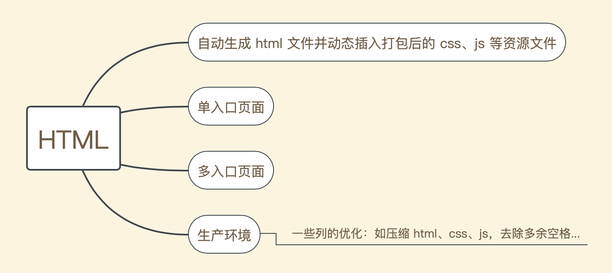
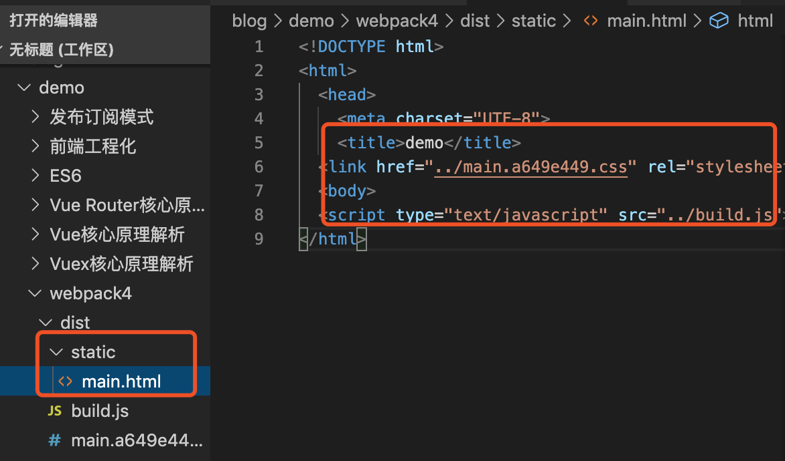

# 打包HTML

## 概述

很多时候，我们需要动态生成`html`文件，并把打包好的资源文件自动插入到`html`中，而不是要我们手动去配置它。这个时候就可以用`html-webpack-plugin`这个插件来实现它

`html-webpack-plugin`可以做的事情大致如下：



`html-webpack-plugin`包含了很多有趣的配置，常用的如下：

**title**

生成`html`文件的标题

**filename**

输出的`html`文件的名称，如果想创建把该文件放在某个目录中，前边可以带上目录，如：`static/main.html`

**template**

`html`模板所在的文件路径

`template`可以自己指定模板（html、jade...）文件来生成对应的`html`文件，使用自定义模板时要提前安装对应的`loader`，否则`webpack`无法正确解析它

:::tip
当我们在`webpack`配置文件中所配置的`title`与模板中的`title`发生冲突时，打包后动态生成的`html`则以模板中的为准，如果想以`webpack`配置文件中的为准则需要在模板中配置：

`<title><%= htmlWebpackPlugin.options.title %></title>`
:::

**inject**

注入选项，可以配置`script`标签的位置，它包含四个选项，如下：

- true：默认值，`script`标签位于`html`文件的`body`底部
- body：和`true`一样，`script`标签位于`html`文件的`body`底部
- head：`script`标签位于`head`内部
- false：只生成`html`文件，不插入生成的`js、css`文件

**favicon**

给生成的`html`配置一个`favicon`，属性值为`favicon`文件所在的路径

**hash**

给动态插入的打包后的`js、css`等资源生成一个`hash`值。

如果某个资源有更改，`webpack`重新打包后会生成一个新的`hash`值（所有的资源 hash 值都会同时发生改变）给它，这可以有效的防止引入的资源被缓存，举个关于 js 的例子：

```javascript
// hash: false
<script type="text/javascript" src="../build.js"></script>
// hash: true
<script type="text/javascript" src="../build.js?aae465d45cef226edf9f"></script>
```

**showErrors**

`showErrors`可以展示错误信息，如：如果`webpack`编译出现错误，`showErrors`会让`webpack`将错误信息包裹在一个`pre`标签内来展示它，从而方便我们定位错误

## 单入口应用配置

#### 使用

1. 安装：`cnpm install html-webpack-plugin -D`

2. 编辑`webpack.config.js`，基础配置如下：

```javascript
// ...
// 动态生成 html
const HtmlWebpackPlugin = require('html-webpack-plugin')

module.exports = {
  // 略略略...
  entry: './src/index.js',
  output: {
    filename: 'build.js',
    path: resolve(__dirname, 'dist')
  },
  plugins: [
    // 略略略...
    // 生成 html 并自动引入打包后的资源
    new HtmlWebpackPlugin({
      // 标题
      title: 'demo',
      // 打包后的路径及名称
      filename: 'static/main.html'
    })
  ]
}
```

3. 终端执行`npx webpack`命令开始打包，成功后，会在`dist`目录下生成`static`目录，里边包含一个动态生成的`main.html`文件，而且打包后的`css、js`文件都会被自动插入到这个`html`中，如下：




## 多入口应用配置

#### 准备工作

将项目目录调整为：

```
├─package.json
├─src                       // 存放入口文件和开发文件
│  └─js                     // js管理
│     └─index1.js  
│     └─index2.js  
│     └─index3.js  
│     └─index4.js  
│  └─pages                  // 页面模板管理
│     └─index1.html  
│     └─index2.html  
│     └─index3.html  
│     └─index4.html  
│  └─style                  // 样式管理
│    └─index.css  
│    └─index.less  
│    └─index.scss  
├─webpack.config.js         // webpack 配置文件
```


#### 开始配置多页应用

`webpack`中如果想配置一个多页应用，需要以下几步：

1. 多入口配置

```javascript
// ...
module.exports = {
  entry: {
    page1: './src/js/index1.js',
    page2: './src/js/index2.js',
    page3: './src/js/index3.js',
    page4: './src/js/index4.js'
  },
  // ...
}
```

2. 多出口配置

```javascript
// ...
module.exports = {
  output: {
    filename: 'js/[name].js',
    path: resolve(__dirname, 'dist')
  }
  // ...
}
```

3. 使用`html-webpack-plugin`插件动态生成`html`

```javascript
// ...
// 自动生成 html
const HtmlWebpackPlugin = require('html-webpack-plugin')

module.exports = {
  // ...
  plugins: [
    new HtmlWebpackPlugin({
      title: 'page1 title',
      filename: 'static/index1.html',
      // 模板
      template: './src/pages/index1.html',
      // 配置该页面引入哪些js
      chunks: ['page1']
    }),
    new HtmlWebpackPlugin({
      title: 'page2 title',
      filename: 'static/index2.html',
      template: './src/pages/index2.html',
      chunks: ['page2']
    }),
    new HtmlWebpackPlugin({
      title: 'page3 title',
      filename: 'static/index3.html',
      template: './src/pages/index3.html',
      chunks: ['page3']
    }),
    new HtmlWebpackPlugin({
      title: 'page4 title',
      filename: 'static/index4.html',
      template: './src/pages/index4.html',
      chunks: ['page4']
    }),
  ],
}
```

`webpack`动态生成多页面的时候，每个动态生成的`html`都会引入所有打包输出的`js`文件。如果想让`html`只引入自己所需的`js`文件，可以使用以下两种方法：

- `chunks`：把所需要的`js`依次注入`chunks`数组中

举例：`chunks: ['page4, vendor']`，这样当前页面就只会引入 page4.js, vendor.js 这两个文件

- `excludeChunks`：排除掉当前页面不需要的`js`文件

举例：`excludeChunks: ['vendor']`，这样当前页面除了 vendor.js ，其余所有输出的 js 都会被引入

#### 多页应用配置改进

由上，我们知道了配置多页应用的思路，但是每次新增一个入口就要写一大堆配置，很麻烦，现在对他们改造一下，由`nodejs`获取文件夹解构来自动生成他们

TODO..TODO..TODO..TODO..TODO..TODO..TODO..TODO..TODO..


## production: 压缩 html

生产环境中为了提高页面的访问速度，我们通常会对资源进行压缩处理，`html-webpack-plugin`中`minify`可以帮助我们对`html`进行压缩，一些常用配置如下：

```javascript
// ...
plugins: [
  new HtmlWebpackPlugin({
    minify: {
      // 是否简写 boolean 格式的属性，如：disabled = 'disabled' 简写为 disabled
      collapseBooleanAttributes: true,
      // 是否去除空格
      collapseWhitespace: true,
      //是否移除注释 默认false
      removeComments: true,
      //是否移除属性的引号 默认false
      removeAttributeQuotes: true,
      //是否压缩 html 里的css
      minifyCSS: true,
      //是否压缩html里的js
      minifyJS: true,
      //从脚本和样式删除的注释 默认false
      removeCommentsFromCDATA: true,
      // ...
    }
  })
]
```
