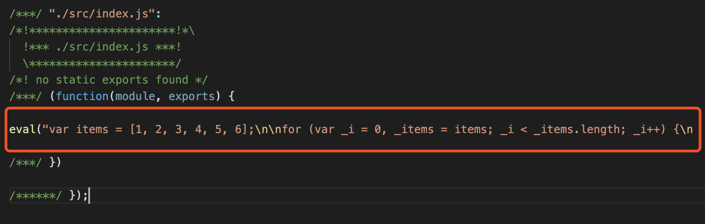
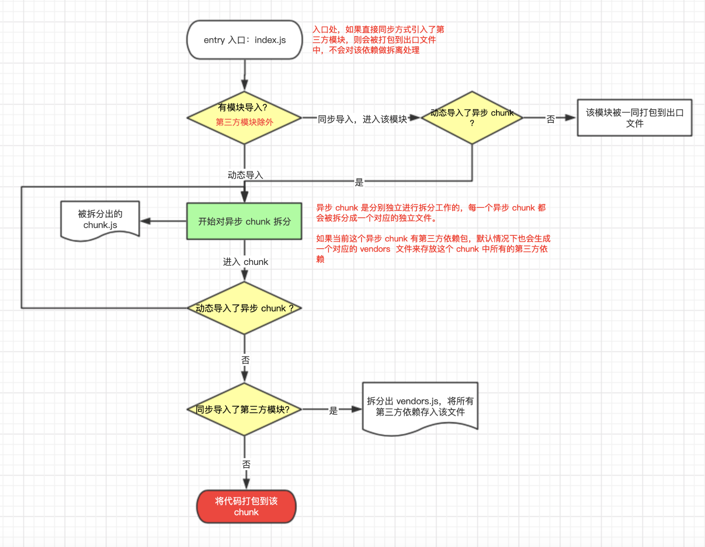
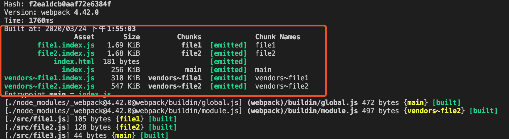
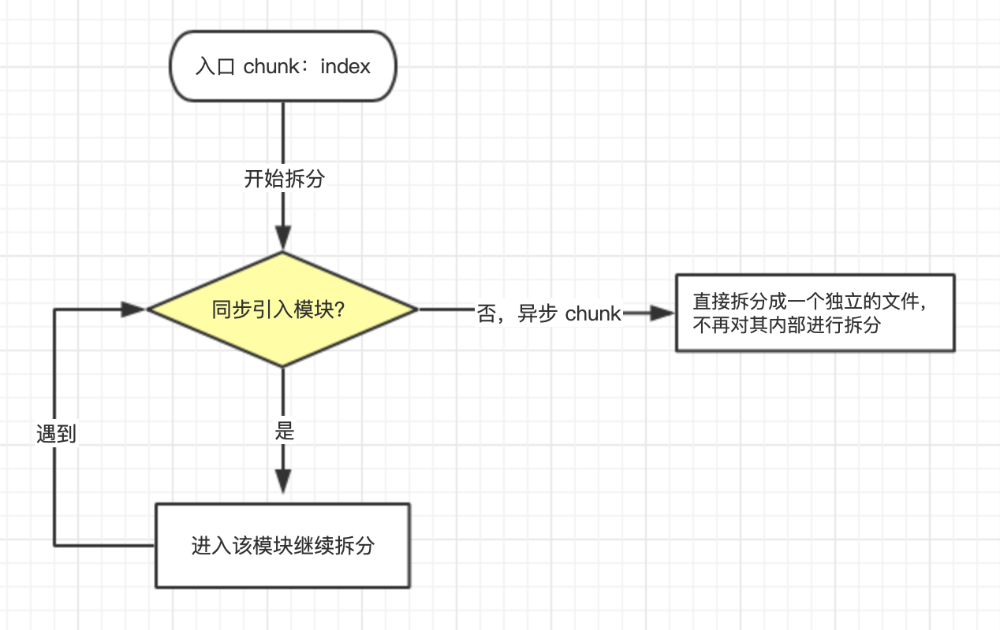
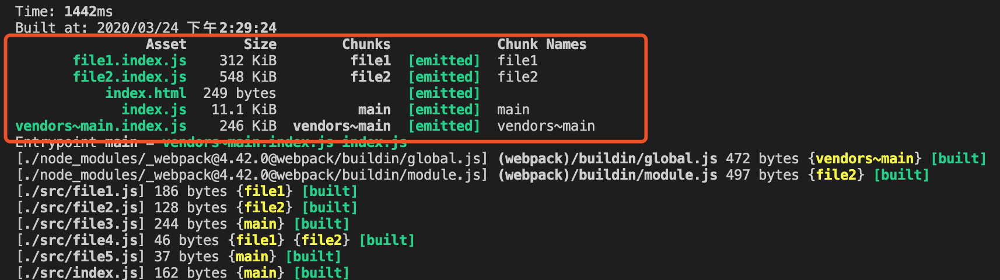
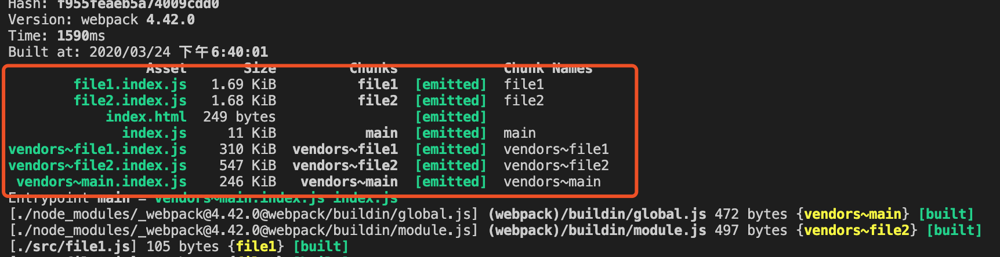

# 打包JS

`webpack`中关于`js`的处理，大致包含以下这些：


## 使用 babel 转换 ES6+ 语法

在使用`babel`转换`ES6+`代码之前，先来了解下关于`babel`的几个基础知识：[关于babel](https://www.jianshu.com/p/0e6673a81fbd)

:::tip

--------------

🍃**babel 是什么**

babel 是一个编译器，它可以将`ES2015+`代码转换成`ES2015`代码，以便能够运行在当前和旧版本浏览器或其他环境中，它的工作流程大致分为以下几步：

1. 解析：通过词法分析、语法分析，将`javascript`源代码转换称为`AST`抽象语法树

2. 转换：将`AST`进行转换操作，再把`ES2015+`的部分转换为`ES5`

3. 输出：将转换后的语法树重新生成代码，然后进行输出

--------------

🍃**插件**

`babel`什么动作都不做，如果不使用插件的话就会将代码解析之后再输出同样的代码，类似于`const babel = code => code`。因此，如果我们想让`babel`按照我们的预期来完成代码转化，那么久需要在转换阶段通过配置的一系列转换插件来帮助我们完成，如：

```javascript
{
  "plugins": [
    "@babel/plugin-transform-arrow-functions", 
    "@babel/plugin-transform-block-scoped-functions",
    //...
   ]
}
```

--------------

🍃**预设 preset**

如果通过手动配置很多的`plugin`，维护起来是很困难的，因此我们可以通过预设`preset`来帮助我们解决这个问题，`preset`是一堆`plugin`的简写，如：

```javascript
{
  presets: ['@babel/preset-env']
}
```
如上，这样写的话就可以默认包含了所有转换`ES5+`标准语法的`plugin`，而不需要我们再去手动一个个的去设置相关`plugin`
:::

## 开始

在开始之前，我们先来创建以下目录：

```
├─package.json
├─src                 // 存放入口文件和开发文件
│  └─index.js  
├─webpack.config.js   // webpack 配置文件
```
接下来打开入口文件，写点`es6`的东西，如下：

```javascript
// src/index.js
const items = [1, 2, 3, 4, 5, 6]

for (let i of items) {
  console.log(i)
}
```

现在开始使用`babel`来编译`es6+`代码，具体如下：


1. 安装

`cnpm install babel-loader @babel/core @babel/preset-env -D`

- babel/core：
- babel/preset-env

2. 编辑`webpack.config.js`，配置如下：

```javascript
const { resolve } = require('path')

module.exports = {
  //...
  module: {
    rules: [{
      test: /\.js$/,
      use: {
        loader: 'babel-loader',
        options: {
          // 预设
          presets: ['@babel/preset-env']
        }
      }
    }]
  }
}
```

终端执行`npx webpack`，进行打包。成功后，打开编译后目录下的`index.js`查看，会发现`es6+`代码已经被编译成了`es5`的代码，如下：




### 补充缺失语法（垫片）

`Babel`只转换`syntax`层语法，所以需要`@babel/polyfill`来处理`API`兼容，又因为`polyfill`体积太大，所以通过`preset`的`useBuiltIns`来实现按需加载，再接着为了满足`npm`组件开发的需要出现了`@babel/runtime`来做隔离。[Babel学习系列4-polyfill和runtime差别(必看)](https://zhuanlan.zhihu.com/p/58624930)

接下来我们来分别看看`babel-polyfill`和`babel-runtime`的使用方法

#### babel-polyfill 

1. 安装：`cnpm install @babel/polyfill -S`

2. 在需要的js文件顶部引入`polyfill` 即可，如下：

```javascript
// src/index.js
import "@babel/polyfill";

const items = [1, 2, 3, 4, 5, 6]
for (let i of items) {
    console.log(i)
}

const mergeArr = Object.assign({}, items)
console.log(mergeArr)
```

再次打包，就会发现之前没有被转译掉的`Object.assign`会正确在浏览器中运行

接下来是对`@babel/polyfill`实现按需加载，如下

```javascript

module.exports = {
  // ...
  module: {
    rules: [
      {
        test: /\.js$/,
          // 不包含
          exclude: /node_modules/,
          loader: 'babel-loader',
          // options 里面的配置也可以放到根目录下的.babelrc 文件中
          options: {
            presets: [['@babel/preset-env', { useBuiltIns: 'usage' }]]
          }
        }
      }
    ] 
  }  
}
```

#### babel-runtime

TODODODODOODO

## 代码分割（优化）

代码分割允许我们把一个大文件拆分成多个小文件，然后去按需/并行加载这些文件，如果使用合理会大大减少页面的加载时间，常用的代码分割的方式有以下三种：

- 入口起点：通过`entry`手动配置多个入口文件
- 避免重复：通过`splitChunks`插件删除并提取公共代码作为一个单独`chunks`
- 动态导入：调用`import()`或`require.ensure()`异步加载模块

下面我们会分别对这三种拆包方式进行试验

### 第一种：entry 多入口拆包

使用`entry`多入口进行拆包，类似这样：

```javascript
// ...
module.exports = {
  // entry: './src/index.js',
  entry: {
    file1: './src/file1.js',
    file2: './src/file2.js',
    // ...
    index: './src/index.js',
  },
  output: {
    // filename: 'index.js',
    filename: '[name].js',
    path: resolve(__dirname, 'dist'),
    libraryTarget: 'umd'
  },
  // ...
}

```

这种方式是由弊端的：

`entry`中配置的所有文件，分别引入了同一个模块时会出现重复打包该模块的情况，而不会把这个共用的模块进行抽离

因此，这种分包方式并没有被广泛使用，接下来可以看看`splitChunks`是如何来解决这种重复打包的情况的

### splitChunks

以前，我们使用`CommonsChunkPlugin`分包来避免依赖重复，但在`4.0`版本开始它已被移除。现在我们通过`optimization.splitChunks`和`optimization.runtimeChunks`来代替它

#### 开始之前

在开始之前，先了解三个名词：[](https://www.cnblogs.com/kwzm/p/10314438.html) 

- module：`js`模块化`webpack`支持`commonjs、es6`等模块化规范，简单来说就是通过`import`等语句引入的代码

- chunk：`chunk`是`webpack`根据功能拆分出来的情况。它包含三种：

  1. 项目入口`entry`
  2. 通过`import()`动态导入的代码
  3. 通过`splitChunks`拆分出来的代码

  `splitChunks`就是在`chunk`的基础上进行拆分的。`chunk`包含`module`，可能是一对一或者一对多

- bundle：`bundle`是`webpack`打包之后生成的文件，一般是和`chunk`一对一的关系

#### 目录准备

在了解`optimization.splitChunks`之前，先准备以下目录：

```
├─package.json
├─src                 
│  └─file1.js         // 同步引入 jquery, vue, file4
│  └─file2.js         // 同步引入 lodash, file4, file5
│  └─file3.js         // 同步引入 file5
│  └─file4.js         // 共用模块，被 file1 和 file2 使用
│  └─file5.js         // 共用模块，被 file2 和 file3 使用
│  └─index.js         // 主入口：异步引入 file1, file2；同步引入 file3, vue
├─webpack.config.js   // webpack 配置文件
```
现有 3 个`chunk`，分别是通过`import`动态导入的`file1`、`file2`和入口文件`index`，其中：

- file1 和 file2 共用`file4`
- file2 和 file3 共用`file5`

文件内容如下：

```javascript
// index.js
import './file3'
import vue from 'vue'
import(/* webpackChunkName: "file1" */'./file1')
import(/* webpackChunkName: "file2" */'./file2')

// file1.js
import $ from 'jquery'
import vue from 'vue'
import { name } from './file4'

// file2.js
import _ from 'lodash'
import { age } from './file4'
import { a } from './file5'

// file3.js
import { a } from './file5'

// file4.js
export const name = 'lily'
export const age = 18

// file5.js
export const a = 123
```

#### 开箱即用

`optimization.splitChunks`是开箱即用的，即对它`不做任何配置`的时候它就可以进行拆包工作。其默认拆分代码规则如下：


```javascript
module.exports = {
  optimization: {
    splitChunks: {
      chunks: "async",
      minSize: 30000,
      maxSize: 0,
      minChunks: 1,
      maxAsyncRequests: 5,
      maxInitialRequests: 3,
      automaticNameDelimiter: "~",
      name: true,
      cacheGroups: {
        vendors: {
          test: /[\\/]node_modules[\\/]/,
          priority: -10
        },
        default: {
          minChunks: 2,
          priority: -20,
          reuseExistingChunk: true
        }
      }
    }
  },
}
```
:::warning
不要在没有实践测量的情况下，尝试手动优化这些参数。默认模式是经过千挑万选的，可以用于满足最佳web性能的策略
:::

说明：

🍃**splitChunks.chunks**

它可以设置三个值，分别是`all、async、initial`。默认值`async`，因为`webpack`更希望将代码中异步引入的部分作为独立模块进行抽离，在需要的时候再引入，这样懒加载的形式可以提升页面性能。三个值的具体表现如下：

- async：默认值，从异步加载（如`import()`动态引入）的`chunk`开始进行拆分，遵循以下规律：

  

  下面来看看`chunks.async`的具体表现：

  

  如图：file1、file2、index 这三个 chunk 被拆分的情况如下：

  1. index：单独抽离到了`index.js`，包括同步引入的`vue`、`file3`及`file3`中同步引入的`file5`
  2. file1：单独抽离成`file1.index.js`；引用的第三方包 jquery 和 vue，都被抽离到了`vendors~file1.index.js`
  3. file2：单独抽离到了`file2.index.js`；引用的第三方包 lodash，抽离到了`vendors~file2.index.js`

---

- initial：从入口处`chunk`开始进行拆分，遵循以下规律：

  

  下面来看看`chunks.initial`的具体表现：

  

  如图：file1、file2、index 这三个 chunk 被拆分的情况如下：
  
  1. file1：被拆分成`file1.index.js`，不对`file1`内容再次进行拆分
  2. file2：被拆分成`file2.index.js`，不对`file2`内容再次进行拆分
  3. index：被拆分成`index.js`，其中引入的第三方模块被拆分到 `vendors~main.index.js`

---

- all：以上两者都包括，同步、异步模块均进行拆分

  

---

🍃**minSize**：

当模块大于`minSize`时，进行代码分割

---
🍃**minChunks**：

该模块最少被使用了`minChunks`时才被分割出来

---
🍃**reuseExistingChunk**：

重复使用已经存在的块，若某个模块在之前已经被打包过了，后面打包时再遇到这个模块就直接使用之前打包的模块

---

🍃**name**：

是否以`cacheGroups`中的`filename`作为文件名

---

🍃**automaticNameDelimiter**：

打包的`chunk`名字连接符，如设为`~`,生成的`chunk`文件名为`chunk~name.js`

---

#### 分包策略

在知道以上这些规则后，我们设置一个自己的[分包策略](https://www.jianshu.com/p/4f0600ea1c5f)，如：

- 基础类库：react，react-redux，react-router
- UI 库：antd，antd-icons
- 公共组件库：自定义的公共组件
- 低频组件：echart
- 业务代码

### 动态导入 import()

动态导入`import()`，是一个异步`chunk`，`webpack`会对它进行单独打包，

`import()`接收模块名作为参数并返回`Promise`：`import(name) -> Promise`

```javascript
// 一个简单的例子：
import('./file1').then(r => {
  //...
})
```
#### 魔法注释

动态导入`import()`不允许我们在导入的时候使用除了文件名以外的任何参数，因此我们可以使用`webpack`中的魔法注释来帮我们使用附加参数，常用的几个如下：

1. webpackChunkName：它可以指定当前异步`chunk`被打包后的文件名称

```javascript
import(/*webpackChunkName*/'./file1').then(r => {
  //...
})
```
2. webpackPrefetch：预先拉取，在使用之前加载；它会在浏览器空闲的时候才来加载该模块

```javascript
import(/*webpackPrefetch: true*/'./file1').then(r => {
  //...
})
```

3. webpackPreload：

懒加载，在使用的时候才去下载（因此会有一定的加载时间造成用户等待）；比如点击某个按钮加载弹窗，在点击按钮的时候，浏览器会马上加载这部分需要的文件


```javascript
import(/*webpackPreload: true*/'./file1').then(r => {
  //...
})
```


