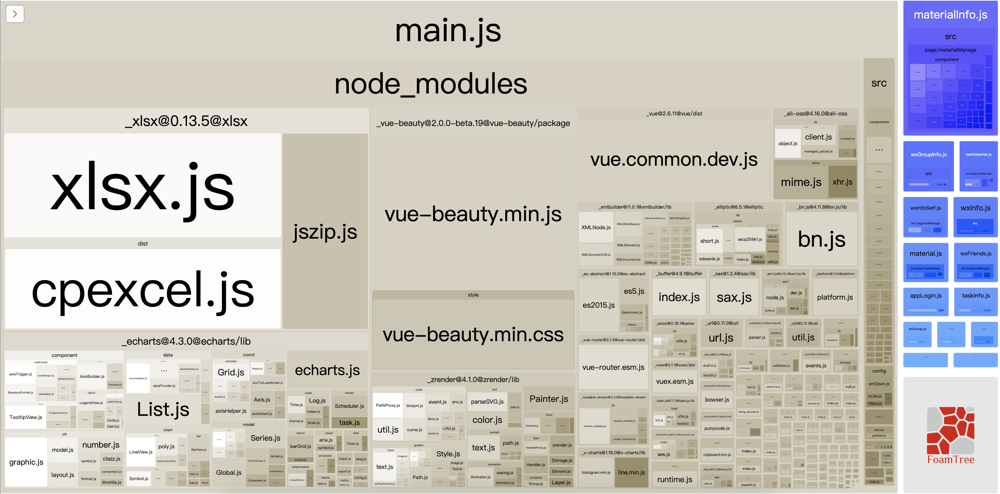
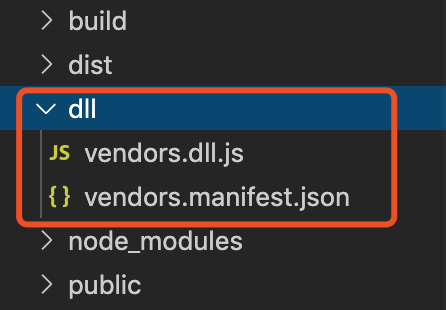
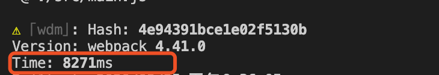

# webpack 打包性能优化

## 开始之前

### 打包结果分析表

要提高我们的打包性能首先得知道我们目前的打包情况，然后去分析到底是哪里拖慢了我们的打包速度；`webpack`中插件`webpack-bundle-analyzer`可以生成代码分析报告，帮助我们提升代码质量和网站性能

#### 配置

1. 安装：`cnpm install webpack-bundle-analyzer -D`

2. 配置 webpack.config.js 文件，如下：

```javascript
const { BundleAnalyzerPlugin } = require('webpack-bundle-analyzer')

module.exports = {
  //...
  plugins: [
    // 分析打包情况
    new BundleAnalyzerPlugin({
      analyzerPort: 8000,
    })
  ]
}
```


## 优化开始

目前的打包速度在`13930ms`左右


现在开始基于这个打包时间来逐步的给项目打包速度进行优化，看看最终会提升多少...

## 1. 开启 happypack 多线程打包

`webpack`是单线程模型的，大量的任务只能一件件的处理，不能同时处理多个事情，`happypack`可以帮我们开启多个线程来处理文件，从而加速代码的构建

:::warning
`happypack`不是所有`loader`都支持的，使用的时候需要注意
:::

`happypack`常用属性如下：

- id: string，用唯一标识符`id`来代表当前的`happypack`是用来处理哪一类的特定文件
- loaders: Array，用法和`webpack loader`配置中的一样
- threadPool：HappyThreadPool，代表共享进程池，及多个`happypack`实例都使用同一个共享进程池中的子进程去处理任务，避免资源占用过多
  ```javascript
  const os = require('os');
  const HappyPack = require('happypack');
  const happyThreadPool = HappyPack.ThreadPool({ size: os.cpus().length });

  // ...
  new Happypack({
    //...
    //共享进程池
    threadPool: happyThreadPool
  })  
  ```

#### 配置

1. 安装：`cnpm install happypack -D`

2. 编辑`webpack.config.js`，如下：

```javascript
//开启多线程打包
const Happypack = require('happypack')

module.exports = {
  //...
  module: {
    rule: [
      {
        test: /\.js$/,
        // 把对 js 的处理转交给 id 为 js 的 happypack 
        use: 'Happypack/loader?id=js'
        // use: {
        //   loader: 'babel-loader'
        // }
      },
    ]
  },
  plugins: [
    // 给 js 开启多线程打包
    new Happypack({
      // id，与 'Happypack/loader?id=js' 此处 id 对应
      id: 'js',
      // loader 必须是一个数组；
      // 处理 js 文件，用法和 loader 中的配置相同
      loaders: ['babel-loader']
    })
  ]
}
```

给`js`加了`happypack`之后打包速度提升了点，现在是`10829ms`，提升了`13930-10829 = 3130 ms`，3s 左右


## 2. dll 动态链接库

项目中如果引用`react、react-dom...`之类的第三方模块的时候，`webpack`都要从`node_modules`中取出来对应的模块，然后再打包到代码中，这个过程会消耗一定的打包时间，而且这些第三方资源基本上不会变动，同时把这些第三方资源通过`splitChunks`全都合并到一个文件中，这个文件也会很大。

`dll`可以帮我们在第一次打包的时候把这些第三方资源生成一个文件保存起来，等再次打包的时候可以直接用保存起来的这些代码而不需要再重新从`node_modules`中取出他们并打包了，而且节省了打包的时间

### 配置

1. 新建`webpack.dll.js`文件，编辑如下：

```javascript
const path = require('path')
const webpack = require('webpack')

module.exports = {
  entry: {
    // 包含所有第三方模块
    vendors: [
      'vue/dist/vue.common.js',
      'vuex',
      'vue-router',
      'vue-beauty',
      'axios',
      'vue-clipboard2',
      'xlsx',
      'md5',
      'js-base64'
    ]
  },
  output: {
    filename: '[name].dll.js',
    path: path.resolve(__dirname, '../dll'),
    // 把所有第三方模块通过全局变量的方式暴露出去
    library: '[name]',
    // publicPath: '',
  },
  plugins: [
    // 借助 dllPlugin 插件对暴露的模块代码做分析，生成 manifest.json 映射文件
    new webpack.DllPlugin({
      name: '[name]',
      path: path.resolve(__dirname, '../dll/[name].manifest.json')
    })
  ]
}
```

2. 打开`package.json`设置打包`dll`的命令，如下：

```javascript
{
  //...
  "scripts": {
    "dll": "webpack --config ./build/webpack.dll.config.js",
    //...
  },
}
```

3. 终端执行命令`npm run dll`，生成`dll/vendors.dll.js`和`dll.vendors.manifest.json`这两个文件



4. 配置`webpack.config.js`文件，如下：

安装：`cnpm install add-asset-html-webpack-plugin -D`

```javascript
const AddAssetHtmlWebpackPlugin = require('add-asset-html-webpack-plugin')

module.exports = {
  // ...
  plugins: [
     // dll：给 html 上增加静态资源
    new AddAssetHtmlWebpackPlugin({
      filepath: path.resolve(__dirname, '../dll/vendors.dll.js')
    }),
    new webpack.DllReferencePlugin({
      manifest: path.resolve(__dirname, '../dll/vendors.manifest.json')
    })
  ]
}
```

最后，来看看通过`dll`抽离第三方库会提升多少打包速度，现在是`8271ms`，提升了`10829-8271 = 2558 ms`，2~3s



## 3. loader 提升

`loader`中有一些属性可以帮助`webpack`打包性能得到提升，常用的如下：

1. exclude：优化构建时的搜索路径，表示哪些目录中的`js`文件不要进行`babel-loader`处理
2. include：优化构建时的搜索路径，表示哪些目录中的`js`文件需要进行`babel-loader`处理
3. cacheDirectory：值为`true`时可以对`babel-loader`的转译结果进行缓存

`babel`对代码进行转译的过程是十分耗费时间的，设置了`cacheDirectory`为`true`后，未来的`Webpack`构建将尝试从缓存中读取，以避免在每次运行时运行潜在昂贵的`Babel`重新编译过程

使用方法如下：

```javascript
// 基于 happypack 做测试
module.exports = {
  module: {
    rules: [
      {
        test: /\.js$/,
      + exclude: /node_modules/,
      + include: path.join(__dirname, '../src'),
        use: 'HappyPack/loader?id=js',
      },
    ]
  },
  plugins: [
    new HappyPack({
      id: 'js',
      // loaders: ['babel-loader']
    + loaders: ['babel-loader?cacheDirectory=true'],
      threadPool: happyThreadPool
    }),
  ]
}
```

来看看通过对`loader`的优化会提升多少打包速度，现在是`5303ms`，提升了`8271-5303 = 2966 ms`，2~3s


## 4. resolve 提升

- resolve.alias：配置项通过别名来把原导入路径映射成一个新的导入路径，减少耗时的递归解析操作，能让 Webpack 更快找到路径
- resolve.extensions：在导入语句没带文件后缀时，webpack 会根据`resolve.extension`自动带上后缀后去尝试询问文件是否存在，使用时要注意：
  - 尽可能精简，一些项目中用不到的不要写上去
  - 使用频率高的放在前面，这能保证尽快退出查找过程
  - 源码中写入导入语句时，尽可能带上后缀名，这样可以避免消耗查找过程的时间

```javascript
module.exports = {
  resolve: {
    extensions: ['.js', '.vue', '.scss', '.css'],
    alias: {
      'vue$': 'vue/dist/vue.common.js',
      '@': path.join(__dirname, '../src'),
      'config': path.join(__dirname, '../src/config'),
      'components': path.join(__dirname, '../src/components')
    }
  },
}
```